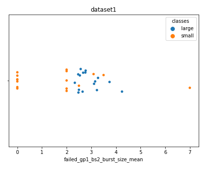

This repository contains the code developed during the M.Sc. Thesis project carried out at the [Technical University of Denmark](https://www.dtu.dk/) as completion of the Master degree in the [Computer Science and Engineering](https://www.dtu.dk/english/education/msc/programmes/computer_science_and_engineering) study line.

# Using Continuous Integration metrics to predict post-release bugs

Our project has investigated a new type of metrics derived from the Continuous Integration pipeline and their performance in the bug prediction task. In practice, we utilized data from a software project’s continuous integration pipeline to predict the number of post-release bugs for software releases.

## Problem statement
The popularity and adoption of software products have increased drastically in
the last decades. Software applications are employed in many different fields,
ranging from entertainment to critical applications. Software systems have also
experienced an increase in complexity, which allowed them to become more
powerful and keep up with the market requirements. These products are usually
developed under various constraints, such as time, resource or budget,
and this aspect represents a challenge when it comes to assess the quality of the
product and deliver fault free software. Indeed, requirements and constraints may vary from one field to another, but one common ambition is to develop
software products with no faults. Faults, or bugs, are intended as deviations
from the expected behavior or the desired functionality, and software companies
are interested in detecting faults in the code as soon as possible, possibly before
the code is released to customers. The early detection of a bug helps solve it
faster, before it is deployed in production and before other software components
rely on that functionality, allowing to limit its consequences. Depending on
the field, a bug reaching the end-user may simply affect the user-experience,
e.g. in case of entertainment, or cause serious damage, in case of safety critical
scenarios.
For these reasons it is important to develop solutions that can support the
decision of whether or not the software is faulty or ready to be released, by
exploiting data produced during its development.

## Methodology
The methodology followed was composed by the following main steps:

In practice, the project selection led us to identify [Sonarqube](https://www.sonarqube.org/) (in its [open source version](https://github.com/SonarSource/sonarqube)) as case study and therefore Github, TravisCI and Jira the main data sources:

## Findings
Several experiments were carried out to test different hypthesis and approaches to the problem in question. We hereafter summarize the main findings and show comparisons.

### Do releases developed using similar CI configurations (e.g build tool) provide better prediction scores?

In this experiment we trained models to predict the number of post-release bugs using builds from periods in which the build tool and CI configuration was based on *maven* (roughly up to March 2018), *gradle* (from March 2018 to present) or all builds. The problem has been first formulated as a regression task (predicting the exact number of post-release bugs).

The problem has later been converted int a binary problem (predicting whether releases would presenting more or less bugs compared to the median value).

It could be observed that limiting observations (hence releases) from homogeneous periods (maven and gradle) provides higher prediction performance.

**Exploring and interpreting the models**

The best performing models were explored and interpreted to obtain insights into which metrics were the most informative when it came to predict the number of post-release bugs for a release.

**Maven**
<table><tr>
<td>  </td>
<td>  </td>
</tr></table>

**Gradle**

The exploration showed that the releases from the two periods (the one where *maven* was in use, and the one where *gradle* was in use) led to different sets of metrics to be selected as most informative for making predictions. In maven we can notice that bursts of failed builds and a high number of builds per PR were selected. In gradle, the number of skipped tasks (sign of little changes which leave most of the tasks untouched and therefore do not need be rerun) was selected.

### Does including all the builds from the development tree (even the ones from development branches later merged via PR) provide better prediction scores?

We constructed two datasets using different sets of builds for each release from which metrics were calculated. The starting set for both method is the list of commits on the main branch since the last released version of the code. However, other builds can be relevant and therefore included in the build set for each release.

* **Dataset1:** included only the builds on the pull requests merged into one of the commits in the starting set: this method
is limited to capture how the final commits included in the release performed
on the CI pipeline.
* **Dataset2:** captures more the whole
development process functional to the release: it includes all builds on development branches that eventually were merged into one of the commits of the starting set.

The comparison between the scores obtained using the two datasets throughout all the combinations of experiments did not show any significant improvement when using one method over the other.

## Conclusions
This research aimed to evaluate whether Continuous Integration execution data
could represent a valid source of information to help predict the quality of a software
release. Based on the results collected from the analysis of the constructed
datasets, it can be conclude that this type of metrics does provide informative
contributions with regards to the prediction of the number of post-release bugs
in software releases. Although we observed unstable or biased predictions in the
regression tasks, in binary classification models performed acceptably, reaching
up to a median of 87% accuracy.
Our approach provides several benefits. Firstly, it allows to exploit often unused
data produced and stored on the CI server. Secondly, it adds a new possible
type of data to be used in the field of bug prediction, which is a complex task
and can benefit from a large plethora of metrics to allow to find the best suited
combination for each project. Lastly, using these CI metrics allows to identify
common CI related traits of releases with similar number of bugs, and therefore
provide guidance in what practices to improve.
The experiments carried out suggest that the proposed metrics are more informative
when collected from a relative homogeneous (configuration and build
tools wise) Continuous Integration period. This result can be of great value to
those interested in utilizing CI metrics for release quality prediction, as they
can limit data collection and extraction only to releases developed using similar Continuous Integration settings. On the other hand, this poses a limitation to
the quantity of valid data available: given that the CI process may evolve over
time, it may be necessary to release a certain amount of versions before having
enough training data.

## Repository structure
* Jupyter Notebooks are stored in this [folder](/notebooks)
    * In this [subfolder](/notebooks/analysis/) are stored the ones containing the analysis of the various datasets
    * In this [subfolder](notebooks/parser_and_validation/) are stored the ones containing the parsing and validation of the raw datasets
* Scripts for retrieving data from the data sources are stored in this [folder](data_retrivers)
* Datasets are stored in csv format and can be found in this [subfolder](/csv)
    * The final datasets for the final analysis/comparison/prediction are stored in this [folder](csv/final_datasets)
